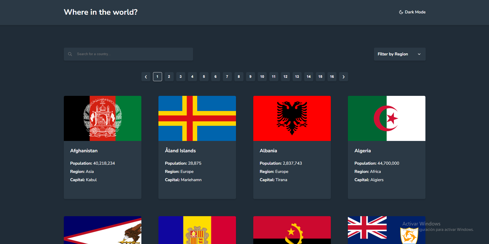
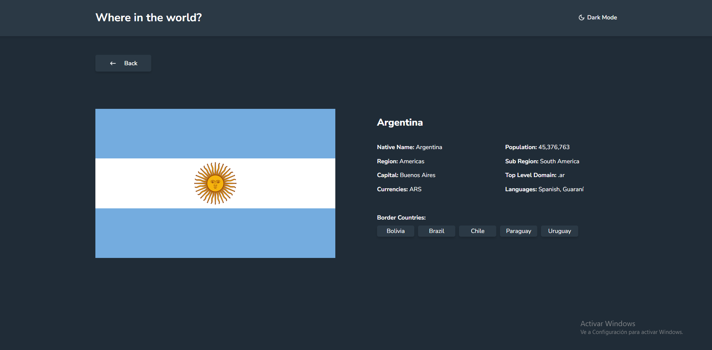

## Table of contents

- [Overview](#overview)
  - [The challenge](#the-challenge)
  - [Screenshot](#home)
  - [Links](#links)
- [My process](#my-process)
  - [Built with](#built-with)
- [Author](#author)

## Overview

### The challenge

Users should be able to:

- See all countries from the API on the homepage
- Search for a country using an `input` field
- Filter countries by region
- Click on a country to see more detailed information on a separate page
- Toggle the color scheme between light and dark mode

### Home

### Country detail

### Links

- Solution URL: [https://github.com/emasaucedodev/countries-app](https://github.com/emasaucedodev/countries-app)
- Live Site URL: [https://countries-app-ochre.vercel.app/](https://countries-app-ochre.vercel.app/)

## My process

### Built with

- Vite template
- React Js
- CSS Modules for styles
- React-router-dom library for routing
- React-icons library

## Author

- Portfolio - [Add your name here](https://www.your-site.com)
- Github - [@emasaucedodev](https://github.com/emasaucedodev)
- Linkedin - [@emanuelsaucedo](https://www.linkedin.com/in/emanuelsaucedo/)

